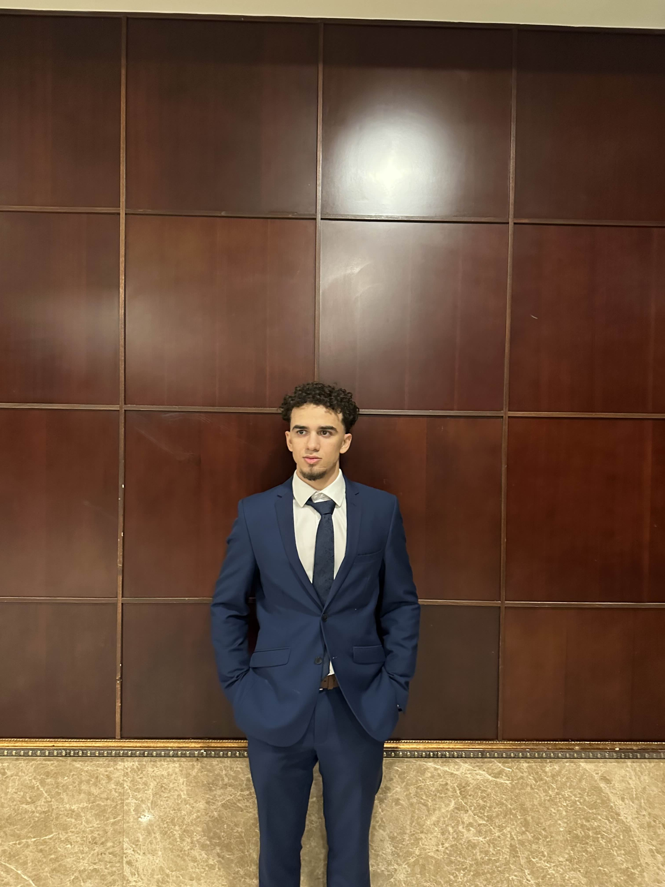

# Computer Science Student

### Education
H.Bsc., Computer Science | Wilfrid Laurier University (_June 2026_)

### Technical Skills
Languages: Python, Java, C/C++, C#, SQL, JavaScript, HTML/CSS
Frameworks: MYSQL, Oracle, Adobe, Unity, Django, Spring boot, Flask, Pandas
Developer Tools: Git, Unix/Linux, VS Code, MYSQL, Eclipse, Netbeans

### Experience

### Projects

